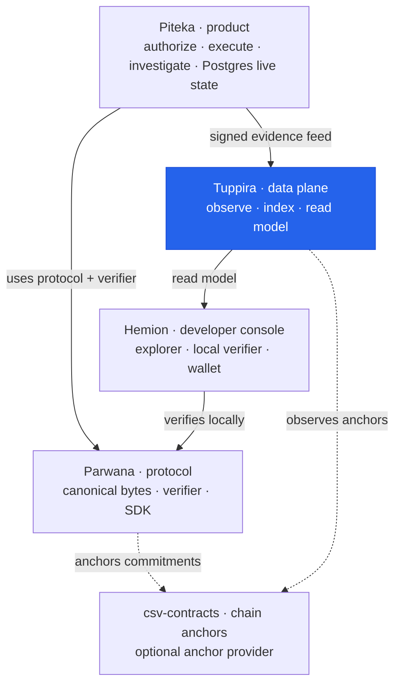

# Tuppira

Tenant-scoped observation GraphQL/REST reads require both
`X-Tuppira-Tenant-Id` and `Authorization: Bearer <token>`. Configure credentials
with `TUPPIRA_OBSERVATION_API_KEYS` as a comma-separated list of
`tenant-id=opaque-token` pairs. Keep this value in the deployment secret store;
when it is absent, observation endpoints fail closed with HTTP 503. Ordinary
observation responses expose normalized projections and lineage only—never raw
bytes, custody locators, or raw-payload digests.

Tuppira is the **indexer for the Parwana protocol** — built entirely in Rust.

It is deliberately *not* an all-in-one block explorer. Tuppira traces only the
transactions, contracts, and accounts that belong to Parwana (CSV — Cross-Chain
Sealed Verifiable — sanads, seals, transfers, and contracts). For any
visualization deeper than that protocol-scoped data, it links out to each
chain's **official** block explorer rather than reproducing it, fetching only
the data Parwana needs. This keeps the focus on the protocol instead of chasing
the deepest all-chain user experience.

The developer-facing UI (explorer, wallet, and protocol debugger) is
[Hemion](../hemion); Tuppira is the data layer beneath it.

## Topology

Where Tuppira sits in the DieWan Accountability Platform:



**You are here — Tuppira**, the data plane. It *observes and indexes* Parwana
activity (from the [Piteka](../piteka) evidence feed and from chains) and serves
a read model to [Hemion](../hemion). It never authorizes anything and never
redefines [Parwana](../parwana) protocol meaning. See the org charter in
[`development/ARCHITECTURE.md`](../development/ARCHITECTURE.md).

## Glossary

Key terms a newcomer will meet in Tuppira:

| Term | Kind | Plain-English meaning | Real-world example |
|------|------|-----------------------|--------------------|
| CSV (Cross-Chain Sealed Verifiable) | Keyword | The Parwana protocol data Tuppira traces — sanads, seals, transfers, and contracts — validated client-side. | The specific "shipments" this tracker follows, ignoring everything else on the chain. |
| Sanad | Data structure | Parwana's proof-carrying ownership instrument; stored by Tuppira as `SanadRecord`. | A property deed that carries its own chain of proof. |
| Seal | Data structure | A consumable ownership condition closed exactly once; stored as `SealRecord`. | A tamper-evident seal: once broken, it can't be reused. |
| Transfer | Data structure | A state transition moving ownership; stored as `TransferRecord`. | Endorsing a cheque over to a new payee. |
| Contract | Data structure | A Parwana on-chain contract Tuppira indexes (`CsvContract`); it links out to official explorers for deeper chain data. | A registered agreement whose entries the tracker files. |
| Observation | Keyword | Read-only watching and indexing of protocol activity; Tuppira observes, never authorizes. | A CCTV recorder: it captures events but can't approve them. |
| Lineage | Keyword | The traced chain of related objects (mandate → action → receipt → …). | A parcel's tracking history from dispatch to delivery. |
| Anchor | Keyword | A commitment published on a chain; Tuppira observes anchors but never creates them. | A notary stamp Tuppira reads but cannot issue. |

## Architecture

```
tuppira/
├── shared/      # Shared types, config, and error definitions
├── storage/     # SQLite database layer with repository pattern
├── indexer/     # Multi-chain indexing daemon (Bitcoin, Ethereum, Sui, Aptos, Solana)
├── api/         # GraphQL + REST API for querying indexed data
├── Dockerfile
├── docker-compose.yml
└── config.example.toml
```

### Components

- **Shared** - Core Tuppira types (`SanadRecord`, `TransferRecord`, `SealRecord`, `CsvContract`), configuration, error handling, and the network-aware `block_explorer` link builder
- **Storage** - SQLite database with typed repositories for all entity types, sync progress tracking, and aggregate statistics
- **Indexer** - Chain-agnostic indexing daemon with pluggable `ChainIndexer` trait implementations for Bitcoin, Ethereum, Sui, Aptos, and Solana
- **API** - GraphQL API (primary) + REST API (secondary) for querying the indexed Parwana data, with pagination and filtering

## Quick Start

### Prerequisites

- Rust 1.75+
- SQLite3

### Development

```bash
# Clone and build
cargo build --workspace

# Run indexer
cargo run -p tuppira-indexer -- start

# Run API server
cargo run -p tuppira-api -- start
```

### Docker

```bash
docker compose up -d
```

## Configuration

Copy `config.example.toml` to `config.toml` and adjust:

```bash
cp config.example.toml config.toml
```

Key configuration sections:

- `[database]` - SQLite connection string
- `[api]` - API server host/port
- `[indexer]` - Concurrency, batch size, poll interval
- `[chains.*]` - Per-chain RPC URLs, networks, start blocks

## API Reference

### GraphQL

Endpoint: `http://localhost:8080/graphql`

Key queries:

```graphql
query GetSanads($filter: SanadFilterInput) {
  sanads(filter: $filter) {
    edges {
      node {
        id
        chain
        owner
        status
        createdAt
      }
    }
    pageInfo {
      hasNextPage
      endCursor
    }
  }
}

query GetStats {
  stats {
    totalSanads
    totalTransfers
    totalSeals
    totalContracts
  }
}
```

### REST

Endpoints:

- `GET /api/v1/sanads` - List sanads with filtering
- `GET /api/v1/sanads/:id` - Get single sanad
- `GET /api/v1/transfers` - List transfers
- `GET /api/v1/seals` - List seals
- `GET /api/v1/stats` - Aggregate statistics
- `GET /api/v1/chains` - Chain status information

## Indexer

The indexer runs as a daemon that continuously polls each enabled chain for
Parwana protocol data only — it does not index unrelated chain activity.

### Official explorer link-outs

Tuppira does not render deep per-chain views. Instead, `tuppira_shared::block_explorer`
builds network-aware links to each chain's official explorer
(`tx_url`, `address_url`, `contract_url`). Links are populated at index time for
transactions and served by the API; the same builder is reused by Hemion. When a
`(chain, network)` pair has no public explorer — e.g. a local devnet or Bitcoin
regtest — the builder returns `None` and the field is omitted rather than
fabricated.

### Supported Chains

| Chain | Seal Type | Events Tracked |
|-------|-----------|----------------|
| Bitcoin | UTXO/Tapret | OP_RETURN commitments, Tapret proofs |
| Ethereum | Account/Nullifier | Smart contract events, nullifier registry |
| Sui | Object | Object creation/deletion, Move events |
| Aptos | Resource/Nullifier | Resource changes, Move events |
| Solana | Account | Account state changes, transaction logs |

### Commands

```bash
tuppira-indexer start          # Start the indexer daemon
tuppira-indexer status         # Show current indexer status
tuppira-indexer sync <chain>   # Force sync a specific chain
tuppira-indexer reindex        # Reindex from a specific block
tuppira-indexer reset          # Reset sync progress
```

## Deployment

### Production Docker

```bash
docker compose -f docker-compose.yml up -d
```

### Manual

1. Build release binaries: `cargo build --release --workspace`
2. Configure `config.toml` with production RPC endpoints
3. Start services in order: indexer -> api

## Metrics

Prometheus metrics are exposed at `/metrics` on the API server:

- `tuppira_indexer_blocks_indexed_total` - Total blocks indexed per chain
- `tuppira_indexer_sanads_indexed_total` - Total sanads indexed
- `tuppira_indexer_transfers_indexed_total` - Total transfers indexed
- `tuppira_indexer_sync_lag_seconds` - Sync lag per chain
- `tuppira_indexer_errors_total` - Error counts

## License

MIT OR Apache-2.0
